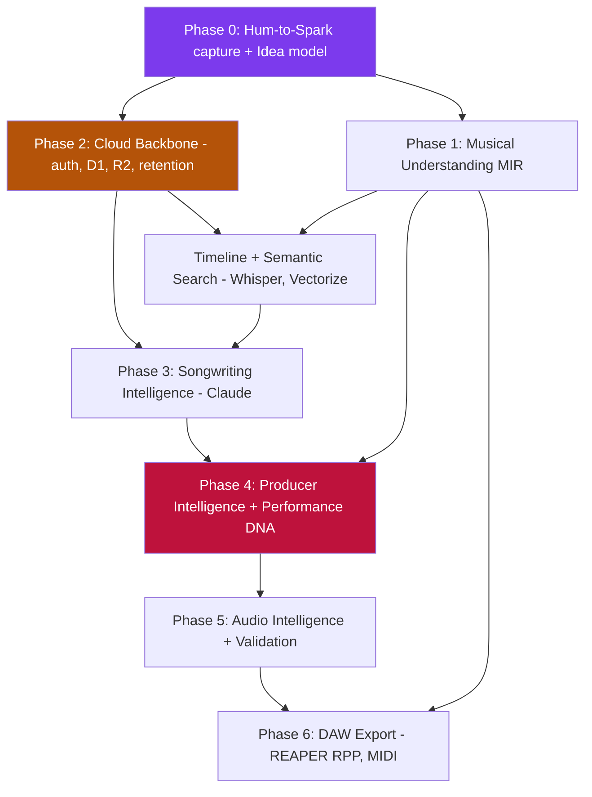
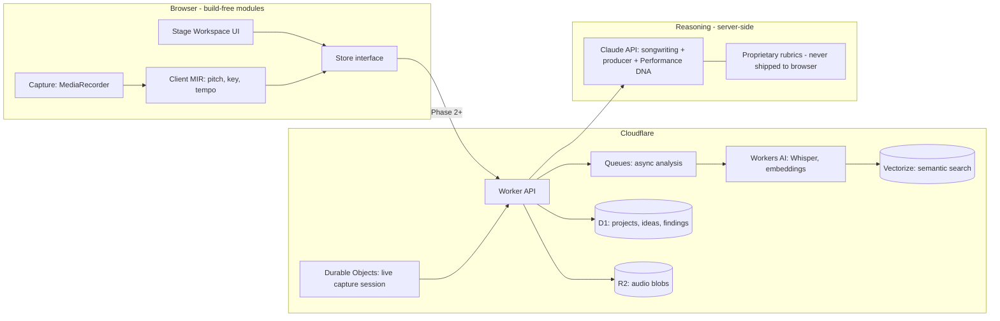

# Cadenzai Evolution Roadmap — From Vocal Architect to Creative Partner

Status: Strategic plan (v1)
Author intent: Turn Cadenzai into an operating system for songwriting and production.
North star: **Never let inspiration disappear.**

This document continues from the existing architecture (`system-architecture.md`,
`implementation-architecture.md`, `recording-analysis-spec.md`). It does not redesign
what already works. It sequences what comes next and assigns each step to the AI best
suited to it.

---

## 1. The one sentence that governs every decision

Cadenzai is **not** an AI music generator. Suno and Udio already own "text → finished song,"
and that race is a commodity race Cadenzai cannot win and should not enter.

Cadenzai's job is the part generators ignore: the distance between *the spark* and *the
finished idea*. It is the memory, the understanding, and the coaching around a human's own
creativity. The moat is the **workflow and the memory**, not the audio output.

Every feature is judged by one test: **does it reduce friction between inspiration and a
finished song?** If not, it does not ship.

---

## 2. Where we are today (honest baseline)

| Capability | State |
| --- | --- |
| Project-based workspace, stage flow | Built (`app.js`, `state.js`) |
| Rule-based vocal chain generation | Built (`recommendation-engine.js`) |
| Local DSP recording analysis (`browser-dsp-0.1.0`) | Built, prototype-grade |
| Evidence-based finding contract (Analyze→Recommend→Process→Validate) | Speced + partly built |
| Owner portal boundary (`/internal/`) | Built |
| Cloud persistence / auth | **Does not exist** |
| AI model actually connected | **None** (`WORKER_URL` is a placeholder) |
| Inspiration capture (hum/sing/speak) | **Does not exist** |
| Inspiration timeline / search | **Does not exist** |

Two structural facts drive the whole roadmap:

1. **The store is already abstracted.** Views and engines talk to a store interface, so
   local storage can be swapped for cloud later *without rewriting the UI*. This is the
   single most valuable architectural decision already in place. Protect it.
2. **There is no backend.** Anything that must work across devices, remember everything, or
   run a server-side model is blocked until a cloud spine exists. That spine is unglamorous
   and it is the real critical path.

---

## 3. Assumptions challenged (be opinionated)

**"Cadenzai should be an AI Creative Partner / generator."**
Reframe: an *operating system for creativity*, not a generator. Do not add a "generate a
song" button. The moment Cadenzai competes with Suno on output quality, it loses. It wins by
owning capture, understanding, memory, and coaching — the things generators structurally
cannot do because they have no relationship with the user's ideas over time.

**"Performance DNA should predict viral / meme / hit potential."**
This is the most dangerous item in the vision. There is no validated model on earth that
reliably predicts virality, and the first time Cadenzai says "this is a viral hook" and it
flops, it loses all credibility. **Do not present prediction as fact.** Reframe Performance
DNA as an *evidence-based coach's read* with explicit confidence: "This has hook-like traits —
short, repeated, wide melodic leap on the payoff." That is honest, defensible, and still
feels magical. Keep the ambition; drop the false certainty.

**"Cadenzai records everything, nothing is ever lost."**
Beautiful promise, real cost: privacy, storage, and always-on microphone trust. Resolve it
with **local-first capture + opt-in cloud sync + explicit retention controls** (the privacy
section of `recording-analysis-spec.md` already sets the right posture). "Nothing is lost"
must mean "nothing *you chose to keep* is lost," not "we secretly record you."

**"Infer chorus/verse/bridge from a 10-second hum."**
You cannot *classify* a section from a 10s clip with no reference — there is nothing to
compare it against. What you *can* do honestly is read *traits*: melodic range, repetition,
contour peak, note density → "chorus-like" vs "verse-like" with confidence. That is the
achievable, honest version of the magic milestone, and it is enough.

**"Framework-free won't scale."**
It will strain, but do **not** rewrite into a framework yet. The store abstraction buys you
years. Rewrites kill small companies. Revisit only when a concrete UI need (real-time
multi-panel state) forces it — not before.

---

## 4. Phased roadmap (MVP → vision)

Each phase ships independent user value. Later phases assume earlier ones.

### Phase 0 — "Hum-to-Spark" (the smallest magical experience) — *client-side only*
Press record → hum 10s → Cadenzai answers with an honest read and saves it forever.
- Browser `MediaRecorder` capture (reuses existing Web Audio infra — **no backend**).
- Client-side monophonic pitch tracking (YIN/autocorrelation) → note sequence.
- Deterministic key estimate (Krumhansl-Schmuckler), rough tempo (if rhythmic), contour stats.
- Honest inference: "chorus-like traits / verse-like traits" + confidence + evidence.
- Persists as a new **Idea (Spark)** object in the existing store → seeds the timeline.
- **Why first:** maximum magic, minimum infrastructure, reuses what exists, and plants the two
  seeds everything else grows from — the *capture primitive* and the *Idea data model*.

### Phase 1 — Musical Understanding — *client-side MIR*
- Firmer key/tempo, melodic contour analysis, self-similarity matrix for structure on longer
  takes, harmony-opportunity hints. All deterministic, all confidence-scored. No large model.

### Phase 2 — The Backbone (cloud spine) — *the unglamorous critical path*
- Auth + cloud persistence (Cloudflare D1 for structured data, R2 for audio blobs).
- Retention controls + explicit consent (per `recording-analysis-spec.md` privacy rules).
- Whisper transcription (Workers AI) so spoken ideas become searchable text.
- Vectorize for semantic timeline search ("the anime song," "the melody I hummed in the car").
- **Unlocks:** cross-device capture, the inspiration timeline, and every server-side model.

### Phase 3 — Songwriting Intelligence — *Claude reasoning*
- Deterministic pre-processing (CMU pronouncing dictionary: rhyme, syllable, stress) feeds
  Claude, which explains **why**: rhyme density, imagery, cliché, story arc, section balance.
- Plugs into the existing Lyrics stage. Highest near-term "wow" achievable with today's AI.

### Phase 4 — Producer Intelligence + Performance DNA — *Claude + heuristics (the signature)*
- Claude reasons over the assembled project context (intent + lyrics + arrangement + analysis)
  to produce producer-grade notes: "the final chorus wants gang vocals," "this verse adds no
  new information." Grounded in evidence, not generic AI prose.
- Performance DNA = structured, server-side rubric (singability, hook strength, emotional arc,
  layering/ad-lib/breath suggestions) scored with confidence. **This is the identity feature.**

### Phase 5 — Audio Intelligence
- Extend `audio-analysis.js`: LUFS (ITU-R BS.1770), stereo image, spectral balance, masking →
  feeds the already-speced Validation loop (before/after, loudness-matched).

### Phase 6 — DAW Integration
- REAPER `.RPP` export first (text format; markers, tempo map, regions, chord track, MIDI
  melody, lyrics, session notes). **Leverages the owner's REAPER/Lua expertise directly.**
- MIDI export from extracted melody. Pro Tools (AAF) later — proprietary and lower ROI.

---

## 5. Dependency graph

Read: **Phase 0 has no prerequisites** (ship now). **Phase 2 (cloud) is the true bottleneck** —
the timeline, cross-device capture, and every server model wait on it. **Phase 4 is the moat**
and depends on both understanding (1) and the reasoning stack (3).

---

## 6. Technical architecture (target state)

Design rules that must hold:
- Proprietary rubrics and Performance DNA logic live **server-side only**. Browser JS is public.
- The client store interface is the seam; the cloud slots in behind it without UI rewrites.
- Every model output carries a confidence and cites evidence — no ungrounded assertions.

---

## 7. AI / model responsibility matrix

Assign by strength. Stop switching models randomly.

| Phase / Milestone | Designs | Implements | Reviews | Tests | Documents |
| --- | --- | --- | --- | --- | --- |
| 0 — Hum-to-Spark | Claude (Opus) | Claude Code + Cody (inline DSP) | Claude Code | Codex (fixture gen) | Claude Code |
| 1 — Musical Understanding | Claude (Opus) | Claude Code | Claude Code | Codex + deterministic fixtures | Claude Code |
| 2 — Cloud Backbone | Claude (Opus) | Claude Code (Wrangler) | Claude Code | Claude Code (integration) | Claude Code |
| 3 — Songwriting Intelligence | Claude (Opus) | Claude Code | Claude (Sonnet) 2nd pass | Claude Code (eval set) | Claude Code |
| 4 — Producer + Performance DNA | Claude (Opus) | Claude Code | Claude (Opus, adversarial) | Claude Code + human rubric | Claude Code |
| 5 — Audio Intelligence | Claude (Opus) | Claude Code + Cody | Claude Code | Deterministic DSP fixtures | Claude Code |
| 6 — DAW Export | Claude (Opus) | Claude Code (RPP/Lua) | Claude Code | Round-trip in REAPER (human) | Claude Code |

Model-strength logic:
- **Claude Opus 4.8** — architecture, the "why" reasoning engine, Performance DNA design,
  adversarial review of its own high-stakes output. Best judgment + long context.
- **Claude Code (this repo)** — primary implementer, orchestrator, and reviewer in-repo.
- **Cody / Codex** — fast inline mechanical work: DSP function bodies, boilerplate, test
  scaffolds. Use *inside* Claude Code's plan, not as a parallel decision-maker.
- **ChatGPT** — optional outside-perspective sanity check / quick research. Not on critical path.
- **GitHub** — source of truth + Actions (tests, deploy gates).
- **Cloudflare** — Workers (API), Workers AI (Whisper + embeddings), Vectorize, D1, R2,
  Durable Objects (live capture), Queues (async jobs). The whole backend already fits the stack.

---

## 8. Required open-source models, APIs, libraries

| Need | Recommendation | Notes |
| --- | --- | --- |
| Capture | Browser `MediaRecorder` / Web Audio | Already available client-side |
| Pitch tracking (hum) | YIN / autocorrelation; CREPE or SPICE if server-side later | Monophonic voice is the easy case |
| Key detection | Krumhansl-Schmuckler profiles | Deterministic, tiny |
| Tempo / onsets | Autocorrelation of onset envelope (librosa-style) | Reliable only on rhythmic input |
| Structure | Self-similarity matrix + novelty | Classic MIR, no big model |
| Rhyme / phonetics | CMU Pronouncing Dictionary | Feeds Claude for lyric analysis |
| Transcription | Cloudflare Workers AI Whisper | Speech + spoken-idea search |
| Embeddings / search | Workers AI embeddings + Vectorize | Powers the timeline |
| Loudness | ITU-R BS.1770 (LUFS) implementation | Extends `audio-analysis.js` |
| Reasoning | Claude API (Opus 4.8 / Sonnet 5) | Songwriting, producer, Performance DNA |
| DAW export | REAPER `.RPP` text writer; MIDI file writer | Pro Tools AAF deferred |

---

## 9. Risks and mitigations

| Risk | Mitigation |
| --- | --- |
| Overpromising (virality, "detects chorus") | Confidence + evidence on every output; trait-language not verdicts |
| Privacy / always-on mic distrust | Local-first, opt-in cloud, explicit retention + consent |
| Competing with Suno/Udio | Never add a generator; own capture→memory→coaching |
| Cloud spine (Phase 2) stalls everything | Ship Phase 0/1 fully client-side so value lands before the backend exists |
| Model cost creep | Deterministic DSP first; call Claude only where reasoning is the product |
| Premature framework rewrite | Hold the line; the store abstraction defers it for years |
| Single-founder bandwidth | Sequence for shippable increments; each phase is independently valuable |

---

## 10. Sequencing calls

**Wait until after launch:** Pro Tools/AAF export, source separation, automatic destructive
audio repair, real-time always-on capture, multi-user collaboration, any hard viral/meme
"prediction" claim.

**Biggest "wow" factor:** (1) Hum-to-Spark instant capture + honest read; (2) Producer
"why it doesn't hit" reasoning; (3) the searchable inspiration timeline ("the anime song").

**Sustainable competitive advantage (moat):** the capture → memory → develop workflow, plus
the Performance DNA rubric held as **server-side proprietary IP**, plus the accumulating
timeline of a user's own ideas. None of it is replicable by a generator.

**Signature identity:** the **Performance DNA Engine** married to **"never let inspiration
disappear"** capture. Those two, together, are what Cadenzai *is*.

---

## 11. The one next task

**Build "Hum-to-Spark": client-side idea capture that records a hum, extracts melody + key +
rough tempo, gives an honest section-*trait* read with confidence, and saves it as an Idea
(Spark) into the store — seeding the inspiration timeline.**

It requires no backend, reuses the existing Web Audio and store layers, delivers the exact
"press record → 'this has chorus-like traits'" magic from the vision, and creates the two
primitives (capture + Idea model) that the entire rest of the roadmap builds on.
