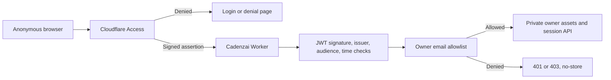

# Cadenzai Owner Authentication

## Current status (verified 2026-07-15)

- Worker `syzygy-vocal-architect` is deployed at version `cd5256d5-0ad8-4131-86a0-b901883ec810`.
- `OWNER_EMAILS` is configured for `rara@syzygyent.com`.
- `CF_ACCESS_TEAM_DOMAIN` and `CF_ACCESS_AUD` exist as Worker secrets.
- The Access team domain is `syzygy-ent.cloudflareaccess.com`.
- The Access application protects `tools.syzygyent.com/internal` and inherited child paths.
- The scoped Worker route is `tools.syzygyent.com/internal*` with Worker-first asset handling.
- `https://tools.syzygyent.com/` remains the existing GitHub Pages application.
- Anonymous `/internal/` and `/internal/api/session` requests redirect to Access with the configured application AUD.
- The direct Workers.dev private endpoint fails closed with `401` when an Access assertion is absent.
- Private responses use a strict CSP without inline script or style allowances.

The edge configuration is production-ready. The only remaining acceptance step is an interactive owner login, session API check, and logout check because the one-time PIN must be entered by the owner.

## Architecture



## Verified production configuration

### Public and private routing

- Public route: `tools.syzygyent.com/` → proxied CNAME → GitHub Pages.
- Private route: `tools.syzygyent.com/internal*` → `syzygy-vocal-architect` Worker.
- Access application path: `tools.syzygyent.com/internal`.

The Access root path inherits its policy to child paths. The Worker wildcard route ensures `/internal`, `/internal/`, private assets, and `/internal/api/session` all execute the authenticated Worker boundary.

### Access application

1. Open **Cloudflare Dashboard > Zero Trust**.
2. Go to **Access controls > Applications**.
3. Select **Create new application**.
4. Select **Self-hosted and private**.
5. Select **Add public hostname** and enter:
   - Application name: `Cadenzai Owner Portal`
   - Subdomain: `tools`
   - Domain: `syzygyent.com`
   - Path: `internal`

Use `internal`, not `internal/*`. Cloudflare path policies inherit to child paths; this protects both `/internal` and everything below it.

6. Under **Access policies**, create an Allow policy:
   - Policy name: `Cadenzai Owner Only`
   - Action: `Allow`
   - Include selector: `Emails`
   - Value: `rara@syzygyent.com`
7. Do not add broad `Everyone`, email-domain, country, or bypass rules.
8. Enable the desired identity provider. Cloudflare One-time PIN is acceptable for the initial single-owner deployment.
9. Set **Session duration** to `8 hours` or shorter.
10. Save the application.

### Worker secret sources

1. In **Zero Trust > Access controls > Applications**, select **Configure** for `Cadenzai Owner Portal`.
2. Open **Additional settings**.
3. Copy **Application Audience (AUD) Tag**.
4. Open **Zero Trust > Settings > Custom Pages** or the team-domain area shown by Cloudflare and record the team domain in the form:
   `https://<team-name>.cloudflareaccess.com`

Do not paste an account ID, zone ID, application ID, or hostname in place of the AUD tag.

## Updating Worker secrets

Run these interactively from the repository; never put the values in source control or command-line arguments:

```powershell
npx.cmd wrangler secret put CF_ACCESS_TEAM_DOMAIN
npx.cmd wrangler secret put CF_ACCESS_AUD
npx.cmd wrangler deploy
```

`CF_ACCESS_TEAM_DOMAIN` may include `https://`; the Worker normalizes it. It must end in `.cloudflareaccess.com`.

## Required final acceptance test

Use a private/incognito browser with no Access cookies:

1. Open `https://tools.syzygyent.com/internal/`.
2. Confirm Cloudflare displays or redirects to the configured login flow; the owner HTML must not appear first.
3. Log in as `rara@syzygyent.com` and enter the one-time PIN delivered to that inbox.
4. Confirm the portal opens and displays that verified email.
5. Open `https://tools.syzygyent.com/internal/api/session`; confirm JSON reports `authenticated: true` and the same email.
6. Sign out using `https://tools.syzygyent.com/cdn-cgi/access/logout`.
7. Reopen `/internal/`; confirm login is required again.
8. Test a different email; confirm Access denies it.

After login, verify internal responses include:

- `Cache-Control: private, no-store, max-age=0`
- `Content-Security-Policy` with `frame-ancestors 'none'`
- `Strict-Transport-Security`
- `X-Content-Type-Options: nosniff`
- `X-Frame-Options: DENY`
- `X-Robots-Tag: noindex, nofollow, noarchive`
- `Referrer-Policy: no-referrer`
- restrictive `Permissions-Policy`

If the browser reports too many redirects, first use the Access logout URL above and remove cookies for both `tools.syzygyent.com` and `syzygy-ent.cloudflareaccess.com`. Repeated refreshing does not damage the deployment. Also confirm that Access **Binding Cookie** is disabled if an incompatible product such as Zaraz or Google tag gateway is enabled on the application hostname.

## Failure behavior

- Missing Worker configuration: `503`, with no internal asset served.
- Missing or invalid assertion: `401`.
- Valid Access identity absent from `OWNER_EMAILS`: `403`.
- Non-GET/HEAD method on `/internal`: `405`.
- Internal successes and failures are private, non-cacheable, and non-indexable.

## Security boundary

Every request runs through the Worker before static assets are considered (`assets.run_worker_first = true`). This setting is mandatory; without it, Cloudflare Static Assets can serve a matching private HTML file without invoking authentication.

The portal establishes authentication and separation only. Proprietary prompts, policies, credentials, and production reasoning must remain in private server-side storage rather than browser-delivered assets.
