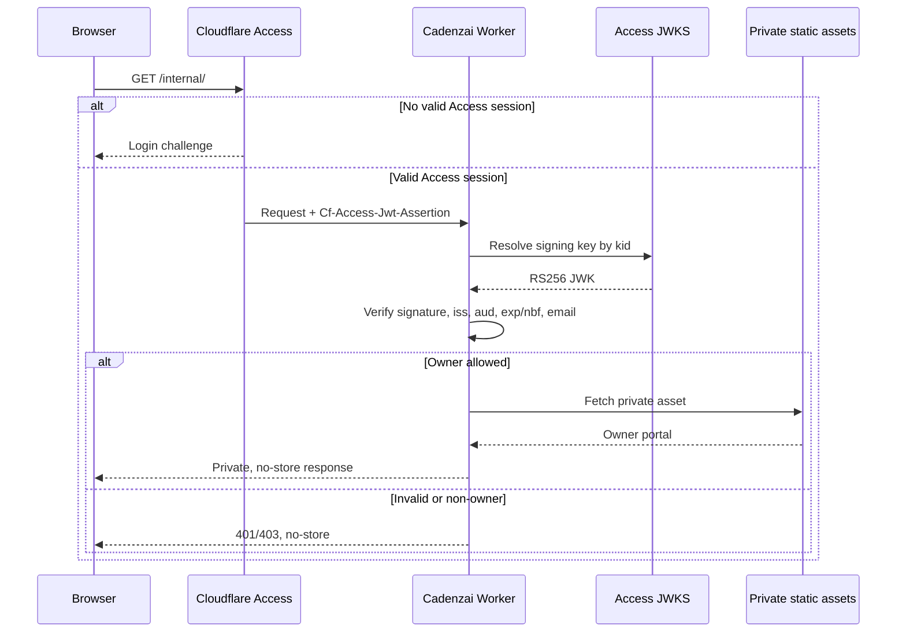

# Cadenzai Owner Portal Deployment Report

Date: 2026-07-15
Status: **Production routing, Access challenge, Worker validation, and security hardening are live; interactive owner acceptance remains.**

## Audit result

| Control | Status | Evidence |
|---|---|---|
| Wrangler configuration | Complete | Current compatibility date, `nodejs_compat`, assets binding, Worker-first asset routing, logs and traces enabled |
| Worker deployment | Complete | Worker version `cd5256d5-0ad8-4131-86a0-b901883ec810` |
| Static asset auth bypass prevention | Complete | Exact `/internal/`, `/internal/index.html`, missing private asset, and session API all execute Worker and fail closed |
| JWT signature validation | Complete in code | RS256 signature checked against matching `kid` from Access JWKS |
| Issuer validation | Complete in code | Exact normalized team-domain issuer required |
| Audience validation | Complete in code | Expected Access application AUD required |
| Expiration / not-before validation | Complete in code | Numeric `exp` required; optional numeric `nbf` enforced |
| Owner email validation | Complete in code and secret | Exact normalized email matched against `OWNER_EMAILS` |
| `OWNER_EMAILS` | Complete | `rara@syzygyent.com`, set through interactive Wrangler prompt |
| `CF_ACCESS_TEAM_DOMAIN` | Complete | Secret exists and active deployment recognizes complete configuration |
| `CF_ACCESS_AUD` | Complete | Secret exists and active deployment recognizes complete configuration |
| Access application | Live | Anonymous private requests redirect to `syzygy-ent.cloudflareaccess.com` with the configured AUD |
| Production routing | Complete | Public root remains GitHub Pages; scoped `/internal*` route executes the Worker |
| Security headers | Complete in code and live fail-closed response | CSP, HSTS, nosniff, DENY framing, no-referrer, permissions policy, CORP, noindex |
| Cache protection | Complete in code and live fail-closed response | `private, no-store, max-age=0` |
| Successful owner login | Acceptance pending | Requires the owner to enter the emailed one-time PIN |
| Inline CSP allowances | Removed | Owner CSS and JavaScript are separate authenticated assets; CSP now permits only same-origin scripts and styles |

## Authentication flow

## Security review

### Fixed during verification

1. **Critical static-asset bypass:** Cloudflare originally served `/internal/` directly as a public static asset before the Worker ran. `assets.run_worker_first = true` now forces authentication ahead of all asset serving. The exact path was retested after cache invalidation.
2. **Incomplete failure headers:** Internal error responses now receive the same no-store, noindex, CSP, anti-framing, referrer, MIME-sniffing, HSTS, and permissions headers as successful private responses.
3. **Unrestricted team-domain input:** JWT key retrieval now accepts only `<team>.cloudflareaccess.com` domains.
4. **Unnecessary methods:** Private endpoints now permit only GET and HEAD.
5. **Oversized assertion handling:** Assertions over 16 KiB are rejected before parsing or signature work.

### Residual risks

- Without an Access assertion, the fully configured Worker correctly denies internal access with `401`.
- The Workers.dev hostname remains public, but private routes fail closed without a valid Access JWT. After production verification, consider disabling `workers.dev` to reduce the exposed surface.
- The Workers.dev hostname remains reachable, but every case variant of the private namespace executes the Worker and requires a valid Access assertion before any asset lookup.
- One-time PIN protects possession of the owner email inbox; phishing-resistant MFA through a stronger identity provider is recommended before proprietary capabilities are stored.
- A stale or incompatible Access binding cookie can cause a browser redirect loop. The recovery procedure is documented in `docs/owner-authentication.md`.
- The repository worktree contains pre-existing uncommitted redesign files. This verification did not stage, commit, or overwrite unrelated changes.

## Remaining acceptance tasks

Follow `docs/owner-authentication.md` and run the owner login, session API, logout, and optional non-owner tests. Anonymous routing, the application challenge, the direct Worker fail-closed response, and the stricter response CSP were reverified after deployment.
